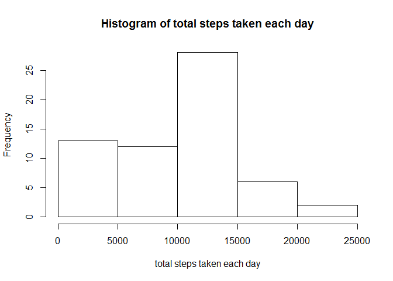
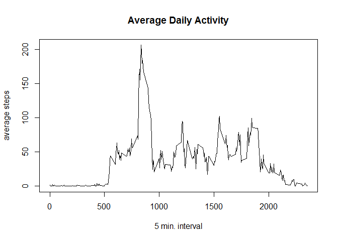
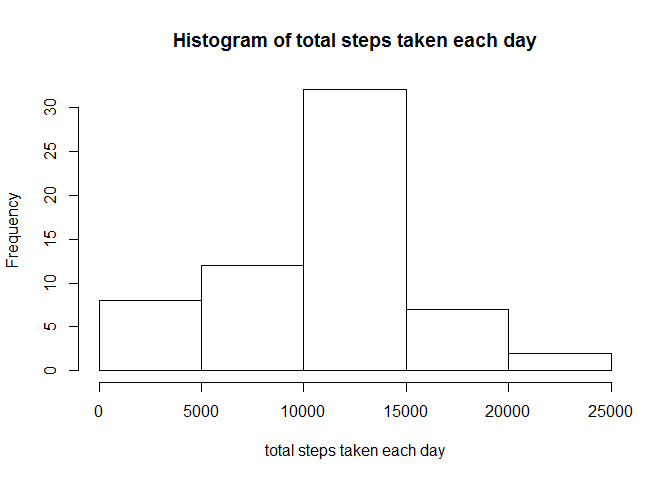
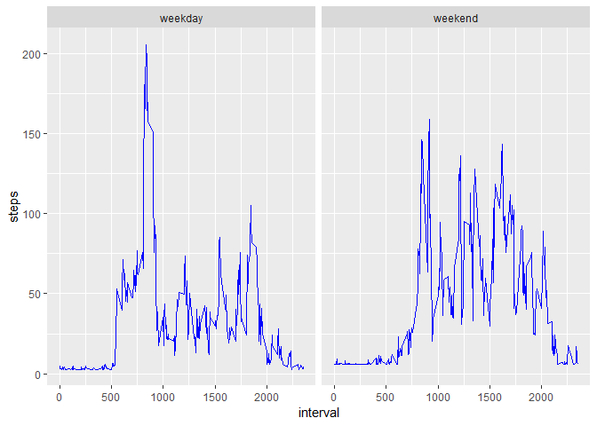

## Loading and preprocessing the data

```r
activities <- read.csv(unz("activity.zip", "activity.csv"))
```
## What is mean total number of steps taken per day?

```r
# Calculate the total steps in each day.
total_steps_day <- tapply(activities$steps, activities$date, sum, na.rm=TRUE)

# Plot the Histogram of total steps taken in each day.
hist(total_steps_day, main="Histogram of total steps taken each day", xlab="total steps taken each day")
```

<!-- -->

```r
# Calculate the mean and median of the total steps in each day.
mean_steps_day <- round(mean(total_steps_day), digits=0)
median_steps_day <- round(median(total_steps_day), digits=0)
```
The mean of the total steps taken each day is 9354

The median of the total steps taken each day is 1.0395\times 10^{4}


## What is the average daily activity pattern?

```r
# Calculate the average steps taken in each 5 minutes interval across all days. 
avg_steps_interval <- tapply(activities$steps, activities$interval, mean, na.rm=TRUE)

# Plot the average taken steps in each 5 minutes interval.
plot(names(avg_steps_interval), avg_steps_interval, type="l", xlab="5 min. interval", ylab="average steps", main="Average Daily Activity")
```

<!-- -->

```r
max_steps_interval <- names(which.max(avg_steps_interval))
```
The maximum number of steps for 5 minutes interval is 835


## Imputing missing values

```r
na_sum <- sum(is.na(activities))

# Calculate the average steps in each day
avg_steps_day <- aggregate(activities$steps, list(activities$date), mean, na.rm=TRUE)
names(avg_steps_day) <- c("date", "steps")

# set NaN to 0
avg_steps_day$steps[is.nan(avg_steps_day$steps)] <- 0

# Filling the missing value with the average steps for that day
activities$steps[is.na(activities$steps)] <- avg_steps_day$steps[activities$date]

# Calculate the total steps taken in each day.
total_steps_day <- tapply(activities$steps, activities$date, sum, na.rm=TRUE)

# Plot the histogram of the total steps taken in each day.
hist(total_steps_day, main="Histogram of total steps taken each day", xlab = "total steps taken each day")
```

<!-- -->

```r
mean_steps_day <- round(mean(total_steps_day), digits=0)
median_steps_day <- round(median(total_steps_day), digits=0)
```
The total number of missing values in the dataset is 2304

The mean of the total number of steps taken per day is 1.0392\times 10^{4}

The median of the total number of steps taken per day is 1.1015\times 10^{4}

The mean and median are increased.


## Are there differences in activity patterns between weekdays and weekends?

```r
# funtions to check if weekdays or weekend.
addWeekdays <- function(x) {
 if (weekdays(as.Date(x[2])) %in% c("Saturday","Sunday")) return("weekend") else return("weekday")
}

# Add additional column of weekdays or weekend.
activities$wdays <- apply(activities, 1, addWeekdays)
 
# Calculate the average steps taken in each 5 minute interval for weekdays or weekends.
avg_steps_interval_wdays <- aggregate(activities$steps, list(activities$wdays, activities$interval), mean, na.rm=TRUE)
names(avg_steps_interval_wdays) <- c("wdays","interval","steps")

# plot the average steps taken in each 5 minutes interval in weekdays or weekends.
library(ggplot2)
g <- ggplot(avg_steps_interval_wdays, aes(interval, steps))
g+geom_line(color="blue")+facet_grid(.~wdays)
```

<!-- -->

